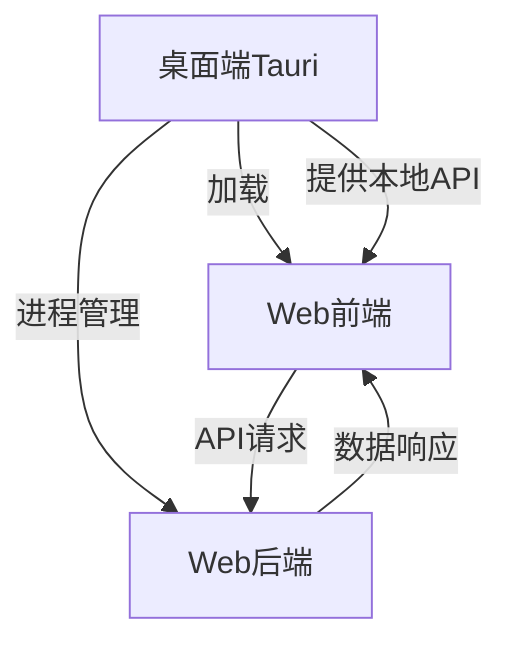

# 项目架构

### 项目指导思想

1. **web技术优先**
    + 由于web技术栈的高兼容度, 因此一切以web优先
    + 需要兼容桌面应用和web应用两种使用方式
    + 桌面场景下web后端由桌面端进行控制 并通过webview加载web前端
    + web场景下web后端部署在linux服务器上 经由传统的web应用访问方式通过用户浏览器访问
2. **性能优先**
   1. 对于web前端优先使用ts进行技术验证, 性能敏感的部分使用rust重写编译成wasm, 再使用webworker加载wasm的方式给web前端使用
   2. 对于web后端优先使用python进行技术验证, 性能敏感的部分使用robyn中的rust进行重写
3. **类型优先**
   1. 各端的代码都使用类型 比如ts, python3的类型系统等
4. **文档优先**
   1. 各个代码实现都由文档指导
   2. 一定保持文档的更新
5. **oop优先**
   1. 除了rust代码以外其余的代码尽量通过oop的方式来进行抽象来降低复杂度
6. **代码质量**
   1. 始终通过完善的单元测试来确保代码质量
   2. 每个提交始终使用ai进行代码review

### 细节

1. 本项目由桌面端 web前端 和web后端 三端组成
2. 桌面端
   1. 桌面端是一个增强型浏览器壳子
   2. 桌面端使用webview加载web前端
   3. 桌面端为其中的web前端提供一系列
3. web后端
   1. 使用由tauri控制 web后端使用robyn框架
4. 性能优化
   1. 优先使用ts或者python进行验证, 验证成功后再使用rust重写(其中web前端可以将rust编译为wasm)
5. 使用subtree来隔离各个子项目

### 架构设计详解

1. **基础架构模式**
   - 采用经典的BS（Browser-Server）架构作为基础
   - 在桌面端场景下，通过Tauri提供增强能力
   - 保持Web版本和桌面版本的统一性和兼容性

2. **三端职责划分**

   a. **Web后端（核心处理层）**
      - 承担主要的业务逻辑和数据处理
      - 提供统一的API接口
      - 处理图像等重量级计算任务
      - 管理数据存储和缓存
      - 使用Robyn框架，关键部分用Rust实现

   b. **Web前端（展示层）**
      - 提供统一的用户界面
      - 处理用户交互
      - 性能关键部分可编译为WASM
      - 可在浏览器或Tauri容器中运行
      - 使用TypeScript确保类型安全

   c. **桌面端（增强容器层）**
      - 作为增强型的Web容器
      - 管理本地Web后端服务（生产环境）
      - 提供本地特权能力（文件系统访问等）
      - 使用Tauri框架，保持轻量级

3. **数据流转模式**

4. **部署模式**
   
   a. **桌面应用模式**
      - Tauri启动并管理本地Web后端
      - Tauri加载Web前端
      - 本地化存储和处理
      - 提供额外的本地能力

   b. **Web应用模式**
      - Web后端部署在服务器
      - Web前端通过浏览器访问
      - 云端存储和处理
      - 保持核心功能完整

5. **技术栈整合**
   - 前端：Vue + TypeScript + WASM（性能关键部分）
   - 后端：Robyn + Python + Rust（性能关键部分）
   - 桌面端：Tauri + Rust
   - 统一使用TypeScript和Python的类型系统
   - 通过OOP降低复杂度

6. **优势**
   - 统一的后端处理逻辑，避免重复实现
   - 无缝切换Web/桌面模式
   - 高度可扩展性
   - 性能优先的技术选型
   - 类型安全的开发体验