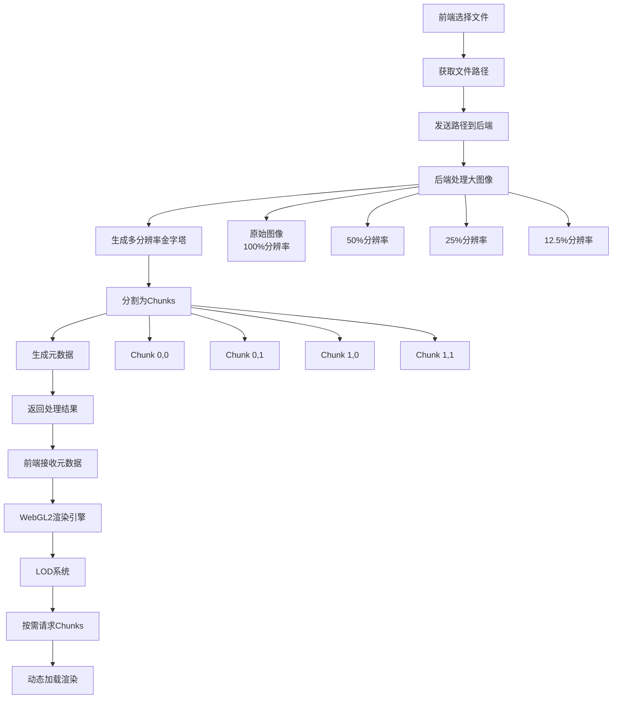

# 大图像 LOD 渲染方案

## 概述

本方案旨在解决超大图像（如病理学图像、卫星图像等）的高效渲染问题。通过图像金字塔、分块处理和 WebGL2 渲染技术，实现流畅的缩放和平移体验。

## 架构设计

### 整体流程



### 核心组件

1. **后端图像处理器**: 负责生成图像金字塔和分块
2. **前端渲染引擎**: WebGL2 渲染和 LOD 管理
3. **缓存系统**: 多级缓存优化性能
4. **API 接口**: RESTful API 提供图像数据

其中 web 后端可以使用python 的opencv库来处理图像，前端使用webgl2 渲染引擎来渲染图像。

## 后端实现

### 图像处理流程

```python
class ImageProcessor:
    def __init__(self, chunk_size=512):
        self.chunk_size = chunk_size
        self.min_size = 256
    
    def process_large_image(self, image_path):
        """
        处理大图像的主要流程
        
        Args:
            image_path (str): 图像文件路径
            
        Returns:
            dict: 包含所有处理结果的元数据
        """
        # 1. 读取原始图像
        original_image = self.load_image(image_path)
        
        # 2. 生成多分辨率金字塔
        pyramid_levels = self.generate_pyramid(original_image)
        
        # 3. 分割成chunks
        chunks_data = self.split_into_chunks(pyramid_levels)
        
        # 4. 生成元数据
        metadata = self.generate_metadata(chunks_data)
        
        # 5. 保存处理结果
        self.save_chunks(chunks_data)
        
        return metadata
    
    def generate_pyramid(self, image):
        """
        生成图像金字塔
        
        策略:
        - 每级分辨率降低50%
        - 直到最小边小于设定阈值
        - 使用高质量重采样算法
        """
        levels = []
        current = image
        level = 0
        
        while min(current.width, current.height) > self.min_size:
            levels.append({
                'level': level,
                'width': current.width,
                'height': current.height,
                'scale': 1.0 / (2 ** level),
                'image': current
            })
            
            # 生成下一级（50%缩放）
            current = self.resize_image(current, scale=0.5)
            level += 1
            
        return levels
    
    def split_into_chunks(self, pyramid_levels):
        """
        将每个金字塔级别分割成固定大小的chunks
        
        Args:
            pyramid_levels: 金字塔级别数据
            
        Returns:
            dict: 按级别组织的chunk数据
        """
        chunks = {}
        
        for level_data in pyramid_levels:
            level = level_data['level']
            image = level_data['image']
            
            chunks[level] = []
            
            # 计算chunk网格
            chunks_x = math.ceil(image.width / self.chunk_size)
            chunks_y = math.ceil(image.height / self.chunk_size)
            
            for y in range(chunks_y):
                for x in range(chunks_x):
                    actual_x = x * self.chunk_size
                    actual_y = y * self.chunk_size
                    
                    # 处理边界chunk
                    chunk_width = min(self.chunk_size, image.width - actual_x)
                    chunk_height = min(self.chunk_size, image.height - actual_y)
                    
                    chunk = {
                        'level': level,
                        'x': x,
                        'y': y,
                        'actual_x': actual_x,
                        'actual_y': actual_y,
                        'width': chunk_width,
                        'height': chunk_height,
                        'data': self.crop_image(image, actual_x, actual_y, chunk_width, chunk_height)
                    }
                    chunks[level].append(chunk)
                    
        return chunks
    
    def generate_metadata(self, chunks_data):
        """生成前端需要的元数据"""
        levels = []
        total_chunks = 0
        
        for level, chunk_list in chunks_data.items():
            level_info = chunk_list[0]  # 获取第一个chunk的级别信息
            
            # 计算该级别的网格信息
            max_x = max(chunk['x'] for chunk in chunk_list)
            max_y = max(chunk['y'] for chunk in chunk_list)
            
            level_metadata = {
                'level': level,
                'width': level_info['actual_x'] + level_info['width'] if chunk_list else 0,
                'height': level_info['actual_y'] + level_info['height'] if chunk_list else 0,
                'scale': 1.0 / (2 ** level),
                'chunk_size': self.chunk_size,
                'chunks_x': max_x + 1,
                'chunks_y': max_y + 1,
                'chunk_count': len(chunk_list)
            }
            
            levels.append(level_metadata)
            total_chunks += len(chunk_list)
        
        return {
            'image_id': self.generate_image_id(),
            'levels': levels,
            'total_chunks': total_chunks,
            'chunk_size': self.chunk_size,
            'processing_time': time.time() - self.start_time
        }
```

### API 接口

```python
from robyn import Robyn
from typing import Optional

app = Robyn(__file__)

@app.post("/api/process-image")
async def process_image(request):
    """
    处理大图像并返回元数据
    
    Request Body:
    {
        "file_path": "/path/to/large/image.png"
    }
    
    Response:
    {
        "status": "success",
        "image_id": "uuid-string",
        "levels": [...],
        "total_chunks": 255,
        "processing_time": 2.3
    }
    """
    data = request.json()
    file_path = data.get('file_path')
    
    if not file_path or not os.path.exists(file_path):
        return {
            "status": "error", 
            "message": "Invalid file path"
        }, 400
    
    try:
        processor = ImageProcessor()
        metadata = processor.process_large_image(file_path)
        
        return {
            "status": "success",
            **metadata
        }
    except Exception as e:
        return {
            "status": "error",
            "message": str(e)
        }, 500

@app.get("/api/chunk/<image_id>/<int:level>/<int:x>/<int:y>")
async def get_chunk(request):
    """
    获取特定的图像块
    
    Parameters:
        image_id: 图像唯一标识
        level: 金字塔级别 (0=最高分辨率)
        x: chunk的x坐标
        y: chunk的y坐标
    
    Response:
        图像数据 (PNG格式)
    """
    image_id = request.path_params['image_id']
    level = int(request.path_params['level'])
    x = int(request.path_params['x'])
    y = int(request.path_params['y'])
    
    try:
        chunk_data = load_chunk_from_storage(image_id, level, x, y)
        
        if chunk_data is None:
            return {"status": "error", "message": "Chunk not found"}, 404
        
        return Response(
            content=chunk_data,
            media_type="image/png",
            headers={
                "Cache-Control": "public, max-age=31536000",  # 缓存1年
                "ETag": f'"{image_id}-{level}-{x}-{y}"',
                "Access-Control-Allow-Origin": "*"
            }
        )
    except Exception as e:
        return {"status": "error", "message": str(e)}, 500

@app.get("/api/image/<image_id>/info")
async def get_image_info(request):
    """获取图像元数据信息"""
    image_id = request.path_params['image_id']
    
    try:
        metadata = load_image_metadata(image_id)
        return metadata
    except Exception as e:
        return {"status": "error", "message": str(e)}, 500
```

## 前端实现

### WebGL2 渲染引擎

```typescript
interface ImageMetadata {
    image_id: string;
    levels: LevelInfo[];
    total_chunks: number;
    chunk_size: number;
}

interface LevelInfo {
    level: number;
    width: number;
    height: number;
    scale: number;
    chunk_size: number;
    chunks_x: number;
    chunks_y: number;
    chunk_count: number;
}

interface ChunkInfo {
    level: number;
    x: number;
    y: number;
}

interface Viewport {
    x: number;
    y: number;
    width: number;
    height: number;
    zoom: number;
}

class ImageRenderer {
    private gl: WebGL2RenderingContext;
    private imageMetadata: ImageMetadata;
    private chunkCache: Map<string, WebGLTexture> = new Map();
    private loadingChunks: Set<string> = new Set();
    private program: WebGLProgram;
    private buffers: {
        position: WebGLBuffer;
        texCoord: WebGLBuffer;
        indices: WebGLBuffer;
    };
    
    async initialize(canvas: HTMLCanvasElement, metadata: ImageMetadata) {
        this.gl = canvas.getContext('webgl2')!;
        this.imageMetadata = metadata;
        
        if (!this.gl) {
            throw new Error('WebGL2 not supported');
        }
        
        this.setupShaders();
        this.setupBuffers();
        
        // 启用必要的WebGL特性
        this.gl.enable(this.gl.BLEND);
        this.gl.blendFunc(this.gl.SRC_ALPHA, this.gl.ONE_MINUS_SRC_ALPHA);
    }
    
    private setupShaders() {
        const vertexShaderSource = `#version 300 es
            in vec2 a_position;
            in vec2 a_texCoord;
            
            uniform mat3 u_transform;
            uniform vec2 u_chunkOffset;
            uniform vec2 u_chunkSize;
            
            out vec2 v_texCoord;
            
            void main() {
                vec2 position = a_position * u_chunkSize + u_chunkOffset;
                vec3 transformed = u_transform * vec3(position, 1.0);
                
                gl_Position = vec4(transformed.xy, 0.0, 1.0);
                v_texCoord = a_texCoord;
            }
        `;
        
        const fragmentShaderSource = `#version 300 es
            precision mediump float;
            
            uniform sampler2D u_texture;
            uniform float u_opacity;
            
            in vec2 v_texCoord;
            out vec4 fragColor;
            
            void main() {
                vec4 color = texture(u_texture, v_texCoord);
                fragColor = vec4(color.rgb, color.a * u_opacity);
            }
        `;
        
        const vertexShader = this.createShader(this.gl.VERTEX_SHADER, vertexShaderSource);
        const fragmentShader = this.createShader(this.gl.FRAGMENT_SHADER, fragmentShaderSource);
        
        this.program = this.createProgram(vertexShader, fragmentShader);
    }
    
    private setupBuffers() {
        // 创建四边形的顶点数据
        const positions = new Float32Array([
            0, 0,  // 左下
            1, 0,  // 右下
            0, 1,  // 左上
            1, 1   // 右上
        ]);
        
        const texCoords = new Float32Array([
            0, 1,  // 左下
            1, 1,  // 右下
            0, 0,  // 左上
            1, 0   // 右上
        ]);
        
        const indices = new Uint16Array([
            0, 1, 2,
            1, 3, 2
        ]);
        
        this.buffers = {
            position: this.createBuffer(positions),
            texCoord: this.createBuffer(texCoords),
            indices: this.createElementBuffer(indices)
        };
    }
    
    async render(viewport: Viewport) {
        // 清除画布
        this.gl.clear(this.gl.COLOR_BUFFER_BIT);
        
        // 计算当前应该使用的LOD级别
        const targetLOD = this.calculateLOD(viewport.zoom);
        
        // 确定需要渲染的chunks
        const visibleChunks = this.getVisibleChunks(viewport, targetLOD);
        
        // 异步加载缺失的chunks
        this.loadMissingChunks(visibleChunks);
        
        // 渲染已加载的chunks
        await this.renderChunks(visibleChunks, viewport);
    }
    
    private calculateLOD(zoom: number): number {
        // 根据缩放级别计算最佳LOD
        // zoom = 1.0 使用level 0 (最高分辨率)
        // zoom = 0.5 使用level 1
        // zoom = 0.25 使用level 2
        const targetLevel = Math.max(0, Math.floor(-Math.log2(zoom)));
        return Math.min(targetLevel, this.imageMetadata.levels.length - 1);
    }
    
    private getVisibleChunks(viewport: Viewport, level: number): ChunkInfo[] {
        const levelData = this.imageMetadata.levels[level];
        if (!levelData) return [];
        
        const chunkSize = levelData.chunk_size;
        const scale = levelData.scale;
        
        // 将视口坐标转换为该级别的坐标
        const scaledViewport = {
            x: viewport.x * scale,
            y: viewport.y * scale,
            width: viewport.width * scale,
            height: viewport.height * scale
        };
        
        // 计算视口覆盖的chunk范围
        const startX = Math.max(0, Math.floor(scaledViewport.x / chunkSize));
        const startY = Math.max(0, Math.floor(scaledViewport.y / chunkSize));
        const endX = Math.min(levelData.chunks_x - 1, 
                             Math.ceil((scaledViewport.x + scaledViewport.width) / chunkSize));
        const endY = Math.min(levelData.chunks_y - 1, 
                             Math.ceil((scaledViewport.y + scaledViewport.height) / chunkSize));
        
        const chunks: ChunkInfo[] = [];
        for (let y = startY; y <= endY; y++) {
            for (let x = startX; x <= endX; x++) {
                chunks.push({ level, x, y });
            }
        }
        
        return chunks;
    }
    
    private async loadMissingChunks(chunks: ChunkInfo[]) {
        const loadPromises = chunks
            .filter(chunk => {
                const key = this.getChunkKey(chunk);
                return !this.chunkCache.has(key) && !this.loadingChunks.has(key);
            })
            .map(chunk => this.loadChunk(chunk));
            
        await Promise.allSettled(loadPromises);
    }
    
    private async loadChunk(chunk: ChunkInfo): Promise<void> {
        const key = this.getChunkKey(chunk);
        if (this.chunkCache.has(key) || this.loadingChunks.has(key)) {
            return;
        }
        
        this.loadingChunks.add(key);
        
        try {
            const response = await fetch(
                `/api/chunk/${this.imageMetadata.image_id}/${chunk.level}/${chunk.x}/${chunk.y}`,
                {
                    headers: {
                        'Accept': 'image/png'
                    }
                }
            );
            
            if (!response.ok) {
                throw new Error(`HTTP ${response.status}: ${response.statusText}`);
            }
            
            const blob = await response.blob();
            const image = await createImageBitmap(blob);
            
            // 创建WebGL纹理
            const texture = this.gl.createTexture()!;
            this.gl.bindTexture(this.gl.TEXTURE_2D, texture);
            this.gl.texImage2D(
                this.gl.TEXTURE_2D, 0, this.gl.RGBA,
                this.gl.RGBA, this.gl.UNSIGNED_BYTE, image
            );
            
            // 设置纹理参数
            this.gl.texParameteri(this.gl.TEXTURE_2D, this.gl.TEXTURE_MIN_FILTER, this.gl.LINEAR);
            this.gl.texParameteri(this.gl.TEXTURE_2D, this.gl.TEXTURE_MAG_FILTER, this.gl.LINEAR);
            this.gl.texParameteri(this.gl.TEXTURE_2D, this.gl.TEXTURE_WRAP_S, this.gl.CLAMP_TO_EDGE);
            this.gl.texParameteri(this.gl.TEXTURE_2D, this.gl.TEXTURE_WRAP_T, this.gl.CLAMP_TO_EDGE);
            
            this.chunkCache.set(key, texture);
            
        } catch (error) {
            console.error(`Failed to load chunk ${key}:`, error);
        } finally {
            this.loadingChunks.delete(key);
        }
    }
    
    private async renderChunks(chunks: ChunkInfo[], viewport: Viewport) {
        this.gl.useProgram(this.program);
        
        // 设置变换矩阵
        const transform = this.calculateTransformMatrix(viewport);
        const transformLocation = this.gl.getUniformLocation(this.program, 'u_transform');
        this.gl.uniformMatrix3fv(transformLocation, false, transform);
        
        // 绑定缓冲区
        this.bindBuffers();
        
        for (const chunk of chunks) {
            const key = this.getChunkKey(chunk);
            const texture = this.chunkCache.get(key);
            
            if (!texture) continue;
            
            // 绑定纹理
            this.gl.activeTexture(this.gl.TEXTURE0);
            this.gl.bindTexture(this.gl.TEXTURE_2D, texture);
            
            // 设置chunk偏移和大小
            const levelData = this.imageMetadata.levels[chunk.level];
            const chunkOffset = [
                chunk.x * levelData.chunk_size,
                chunk.y * levelData.chunk_size
            ];
            const chunkSize = [levelData.chunk_size, levelData.chunk_size];
            
            const offsetLocation = this.gl.getUniformLocation(this.program, 'u_chunkOffset');
            const sizeLocation = this.gl.getUniformLocation(this.program, 'u_chunkSize');
            
            this.gl.uniform2fv(offsetLocation, chunkOffset);
            this.gl.uniform2fv(sizeLocation, chunkSize);
            
            // 设置透明度
            const opacityLocation = this.gl.getUniformLocation(this.program, 'u_opacity');
            this.gl.uniform1f(opacityLocation, 1.0);
            
            // 绘制
            this.gl.drawElements(this.gl.TRIANGLES, 6, this.gl.UNSIGNED_SHORT, 0);
        }
    }
    
    private getChunkKey(chunk: ChunkInfo): string {
        return `${chunk.level}-${chunk.x}-${chunk.y}`;
    }
    
    // WebGL 辅助方法
    private createShader(type: number, source: string): WebGLShader {
        const shader = this.gl.createShader(type)!;
        this.gl.shaderSource(shader, source);
        this.gl.compileShader(shader);
        
        if (!this.gl.getShaderParameter(shader, this.gl.COMPILE_STATUS)) {
            const info = this.gl.getShaderInfoLog(shader);
            this.gl.deleteShader(shader);
            throw new Error(`Shader compilation error: ${info}`);
        }
        
        return shader;
    }
    
    private createProgram(vertexShader: WebGLShader, fragmentShader: WebGLShader): WebGLProgram {
        const program = this.gl.createProgram()!;
        this.gl.attachShader(program, vertexShader);
        this.gl.attachShader(program, fragmentShader);
        this.gl.linkProgram(program);
        
        if (!this.gl.getProgramParameter(program, this.gl.LINK_STATUS)) {
            const info = this.gl.getProgramInfoLog(program);
            this.gl.deleteProgram(program);
            throw new Error(`Program linking error: ${info}`);
        }
        
        return program;
    }
}
```

### LOD 管理系统

```typescript
class LODManager {
    private targetFPS: number = 60;
    private lastFrameTime: number = 0;
    private frameHistory: number[] = [];
    private maxHistoryLength: number = 10;
    
    updateLOD(renderer: ImageRenderer, viewport: Viewport): number {
        const currentTime = performance.now();
        const deltaTime = currentTime - this.lastFrameTime;
        
        if (this.lastFrameTime > 0) {
            const currentFPS = 1000 / deltaTime;
            this.frameHistory.push(currentFPS);
            
            if (this.frameHistory.length > this.maxHistoryLength) {
                this.frameHistory.shift();
            }
        }
        
        this.lastFrameTime = currentTime;
        
        // 计算平均帧率
        const avgFPS = this.frameHistory.length > 0 
            ? this.frameHistory.reduce((a, b) => a + b) / this.frameHistory.length
            : this.targetFPS;
        
        let lodBias = 0;
        
        // 根据性能动态调整LOD
        if (avgFPS < this.targetFPS * 0.8) {
            lodBias = 1; // 降低一个LOD级别
        } else if (avgFPS < this.targetFPS * 0.6) {
            lodBias = 2; // 降低两个LOD级别
        }
        
        // 根据缩放级别计算基础LOD
        const baseLOD = Math.max(0, Math.floor(-Math.log2(viewport.zoom)));
        
        // 应用性能偏移
        const finalLOD = Math.min(
            baseLOD + lodBias,
            renderer.getMaxLODLevel()
        );
        
        return finalLOD;
    }
    
    resetPerformanceHistory() {
        this.frameHistory = [];
    }
}
```

## 性能优化策略

### 1. 缓存系统

- **浏览器HTTP缓存**: 设置长期缓存头，避免重复下载
- **WebGL纹理缓存**: 内存中缓存已加载的纹理
- **LRU清理机制**: 避免内存溢出

### 2. 预加载策略

```typescript
class PreloadManager {
    private preloadQueue: ChunkInfo[] = [];
    private maxConcurrentLoads: number = 4;
    private currentLoads: number = 0;
    
    predictNextChunks(viewport: Viewport, direction: {x: number, y: number}): ChunkInfo[] {
        // 根据移动方向预测需要的chunks
        const predictions: ChunkInfo[] = [];
        
        // 预测算法：沿移动方向预加载额外的chunks
        const extraChunks = 2;
        const currentChunks = this.getCurrentVisibleChunks(viewport);
        
        for (const chunk of currentChunks) {
            // 沿移动方向添加额外的chunks
            if (direction.x > 0) {
                predictions.push({ ...chunk, x: chunk.x + extraChunks });
            }
            if (direction.x < 0) {
                predictions.push({ ...chunk, x: chunk.x - extraChunks });
            }
            if (direction.y > 0) {
                predictions.push({ ...chunk, y: chunk.y + extraChunks });
            }
            if (direction.y < 0) {
                predictions.push({ ...chunk, y: chunk.y - extraChunks });
            }
        }
        
        return predictions.filter(chunk => this.isValidChunk(chunk));
    }
    
    schedulePreload(chunks: ChunkInfo[]) {
        this.preloadQueue.push(...chunks);
        this.processPreloadQueue();
    }
    
    private async processPreloadQueue() {
        while (this.preloadQueue.length > 0 && this.currentLoads < this.maxConcurrentLoads) {
            const chunk = this.preloadQueue.shift()!;
            this.currentLoads++;
            
            try {
                await this.loadChunk(chunk);
            } catch (error) {
                console.warn('Preload failed:', error);
            } finally {
                this.currentLoads--;
            }
        }
    }
}
```

### 3. 渐进式渲染

```typescript
class ProgressiveRenderer {
    async renderWithFallback(chunks: ChunkInfo[], viewport: Viewport) {
        // 1. 先渲染低分辨率版本
        const lowResChunks = this.getLowerLODChunks(chunks);
        await this.renderChunks(lowResChunks, viewport, 0.7); // 70% 透明度
        
        // 2. 逐步替换为高分辨率版本
        for (const chunk of chunks) {
            if (this.isChunkLoaded(chunk)) {
                await this.renderChunk(chunk, viewport, 1.0); // 100% 透明度
            }
        }
    }
    
    private getLowerLODChunks(chunks: ChunkInfo[]): ChunkInfo[] {
        return chunks.map(chunk => ({
            ...chunk,
            level: Math.min(chunk.level + 1, this.maxLODLevel),
            x: Math.floor(chunk.x / 2),
            y: Math.floor(chunk.y / 2)
        }));
    }
}
```

### 4. 内存管理

```typescript
class MemoryManager {
    private maxCacheSize: number = 100 * 1024 * 1024; // 100MB
    private currentCacheSize: number = 0;
    private accessTimes: Map<string, number> = new Map();
    
    cleanupCache(chunkCache: Map<string, WebGLTexture>) {
        if (this.currentCacheSize < this.maxCacheSize) return;
        
        // LRU清理：删除最久未访问的chunks
        const sortedChunks = Array.from(this.accessTimes.entries())
            .sort((a, b) => a[1] - b[1]) // 按访问时间排序
            .slice(0, Math.floor(chunkCache.size * 0.3)); // 删除30%
        
        for (const [chunkKey] of sortedChunks) {
            const texture = chunkCache.get(chunkKey);
            if (texture) {
                this.gl.deleteTexture(texture);
                chunkCache.delete(chunkKey);
                this.accessTimes.delete(chunkKey);
            }
        }
        
        this.recalculateCacheSize(chunkCache);
    }
    
    recordAccess(chunkKey: string) {
        this.accessTimes.set(chunkKey, Date.now());
    }
    
    private recalculateCacheSize(chunkCache: Map<string, WebGLTexture>) {
        // 简化计算：假设每个chunk占用固定内存
        this.currentCacheSize = chunkCache.size * 512 * 512 * 4; // RGBA
    }
}
```

## 关键技术参数

### 推荐配置

- **Chunk大小**: 512x512 像素
- **金字塔级别**: 直到最小边 < 256px
- **并发加载数**: 4-8 个chunk
- **缓存限制**: 100MB WebGL纹理
- **目标帧率**: 60 FPS
- **预加载范围**: 当前视口周围 2 个chunk

### 支持的图像格式

- **输入格式**: PNG, JPEG, TIFF, WebP
- **输出格式**: PNG (无损), WebP (有损，更小文件)
- **色彩深度**: 8-bit RGB/RGBA

## 使用示例

### 初始化渲染器

```typescript
// 1. 处理图像
const response = await fetch('/api/process-image', {
    method: 'POST',
    headers: { 'Content-Type': 'application/json' },
    body: JSON.stringify({ file_path: '/path/to/large/image.png' })
});

const metadata = await response.json();

// 2. 初始化渲染器
const canvas = document.getElementById('canvas') as HTMLCanvasElement;
const renderer = new ImageRenderer();
await renderer.initialize(canvas, metadata);

// 3. 设置渲染循环
let viewport = { x: 0, y: 0, width: canvas.width, height: canvas.height, zoom: 1.0 };

function render() {
    renderer.render(viewport);
    requestAnimationFrame(render);
}

render();
```

### 交互控制

```typescript
class ViewportController {
    constructor(private canvas: HTMLCanvasElement, private renderer: ImageRenderer) {
        this.setupEventListeners();
    }
    
    private setupEventListeners() {
        // 鼠标拖拽
        this.canvas.addEventListener('mousedown', this.onMouseDown.bind(this));
        this.canvas.addEventListener('mousemove', this.onMouseMove.bind(this));
        this.canvas.addEventListener('mouseup', this.onMouseUp.bind(this));
        
        // 滚轮缩放
        this.canvas.addEventListener('wheel', this.onWheel.bind(this));
        
        // 触摸支持
        this.canvas.addEventListener('touchstart', this.onTouchStart.bind(this));
        this.canvas.addEventListener('touchmove', this.onTouchMove.bind(this));
        this.canvas.addEventListener('touchend', this.onTouchEnd.bind(this));
    }
    
    private onWheel(event: WheelEvent) {
        event.preventDefault();
        
        const zoomFactor = event.deltaY > 0 ? 0.9 : 1.1;
        const newZoom = Math.max(0.1, Math.min(10.0, this.viewport.zoom * zoomFactor));
        
        // 围绕鼠标位置缩放
        const rect = this.canvas.getBoundingClientRect();
        const mouseX = event.clientX - rect.left;
        const mouseY = event.clientY - rect.top;
        
        this.zoomToPoint(mouseX, mouseY, newZoom);
    }
    
    private zoomToPoint(x: number, y: number, newZoom: number) {
        const oldZoom = this.viewport.zoom;
        const zoomRatio = newZoom / oldZoom;
        
        // 计算新的视口位置
        this.viewport.x = x - (x - this.viewport.x) * zoomRatio;
        this.viewport.y = y - (y - this.viewport.y) * zoomRatio;
        this.viewport.zoom = newZoom;
        
        this.renderer.render(this.viewport);
    }
}
```

## 故障排除

### 常见问题

1. **内存溢出**: 调整缓存大小限制和清理策略
2. **加载缓慢**: 增加并发加载数量，优化网络配置
3. **渲染卡顿**: 降低目标帧率，启用LOD自适应
4. **图像模糊**: 检查WebGL纹理过滤设置
5. **跨域问题**: 配置正确的CORS头

### 性能监控

```typescript
class PerformanceMonitor {
    private stats = {
        frameTime: 0,
        renderTime: 0,
        loadTime: 0,
        cacheHitRate: 0,
        activeLOD: 0
    };
    
    startFrame() {
        this.frameStartTime = performance.now();
    }
    
    endFrame() {
        this.stats.frameTime = performance.now() - this.frameStartTime;
    }
    
    logStats() {
        console.log('Performance Stats:', {
            FPS: Math.round(1000 / this.stats.frameTime),
            'Render Time': `${this.stats.renderTime.toFixed(2)}ms`,
            'Cache Hit Rate': `${(this.stats.cacheHitRate * 100).toFixed(1)}%`,
            'Active LOD': this.stats.activeLOD
        });
    }
}
```

## 未来优化方向

1. **WebGPU支持**: 利用更现代的GPU API
2. **压缩纹理**: 使用DXT/ETC压缩减少内存使用
3. **多线程处理**: Web Workers并行处理图像
4. **智能预测**: 机器学习预测用户行为
5. **服务端渲染**: 边缘计算预处理常用视图
