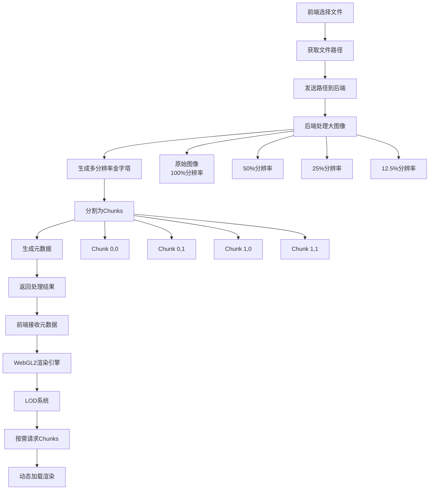

# 大图像 LOD 渲染方案

## 概述

本方案旨在解决超大图像（如病理学图像、卫星图像等）的高效渲染问题。通过图像金字塔、分块处理和 WebGL2 渲染技术，实现流畅的缩放和平移体验。

## 架构设计

### 整体流程

### 核心组件

1. **后端图像处理器**: 负责生成图像金字塔和分块
2. **前端渲染引擎**: WebGL2 渲染和 LOD 管理
3. **缓存系统**: 多级缓存优化性能
4. **API 接口**: RESTful API 提供图像数据

## 技术实现

### 1. 后端实现

#### 1.1 图像处理流程
- 读取原始图像
- 生成多分辨率金字塔
- 分割成固定大小的 chunks
- 生成元数据
- 保存处理结果

#### 1.2 API 接口
- `/api/process-image`: 处理大图像并返回元数据
- `/api/chunk/<image_id>/<level>/<x>/<y>`: 获取特定图像块
- `/api/image/<image_id>/info`: 获取图像元数据信息

### 2. 前端实现

#### 2.1 WebGL2 渲染引擎
- 初始化 WebGL2 上下文
- 设置着色器程序
- 管理纹理和缓冲区
- 实现渲染循环

#### 2.2 LOD 管理系统
- 计算当前 LOD 级别
- 确定可见 chunks
- 管理 chunk 加载
- 实现渐进式渲染

### 3. 高级特性

#### 3.1 内存分层管理
- CPU 内存管理（200MB 限制）
- GPU 内存管理（500MB 限制）
- 最大纹理数量控制（1000个）
- LRU 缓存策略

#### 3.2 视锥体剔除
- 计算视锥体平面
- 包围盒检测
- 快速剔除算法
- 边缘 chunk 处理

#### 3.3 预测性加载
- 移动轨迹记录
- 速度和加速度计算
- 位置预测
- 优先级排序

## 性能优化策略

### 1. 缓存系统
- 浏览器 HTTP 缓存
- WebGL 纹理缓存
- LRU 清理机制

### 2. 预加载策略
- 预测下一步加载
- 并发请求控制
- 优先级队列
- 方向性预加载

### 3. 渐进式渲染
- 低分辨率快速预览
- 逐步替换高分辨率
- 平滑过渡效果
- 加载状态反馈

### 4. 内存管理
- 定期清理机制
- 使用量监控
- 自适应调节
- 紧急释放策略

## 关键技术参数

### 1. 基础配置
- Chunk 大小: 512x512 像素
- 金字塔级别: 直到最小边 < 256px
- 并发加载数: 4-8 个 chunk
- 缓存限制: 100MB WebGL 纹理

### 2. 性能目标
- 目标帧率: 60 FPS
- 最大加载延迟: 100ms
- 内存使用率: <80%
- 缓存命中率: >90%

### 3. 内存限制
- CPU 内存: 200MB
- GPU 内存: 500MB
- 最大纹理数: 1000个
- 预加载半径: 2 chunks

### 4. 支持的图像格式
- 输入格式: PNG, JPEG, TIFF, WebP
- 输出格式: PNG (无损), WebP (有损)
- 色彩深度: 8-bit RGB/RGBA

## 故障排除

### 常见问题
1. **内存溢出**: 调整缓存大小限制和清理策略
2. **加载缓慢**: 增加并发加载数量，优化网络配置
3. **渲染卡顿**: 降低目标帧率，启用 LOD 自适应
4. **图像模糊**: 检查 WebGL 纹理过滤设置
5. **跨域问题**: 配置正确的 CORS 头

### 性能监控
- 帧率监控
- 渲染时间统计
- 缓存命中率
- 内存使用情况

## 未来优化方向

1. **WebGPU 支持**: 利用更现代的 GPU API
2. **压缩纹理**: 使用 DXT/ETC 压缩减少内存使用
3. **多线程处理**: Web Workers 并行处理图像
4. **预测**: 预测用户行为,提前加载可能的块
